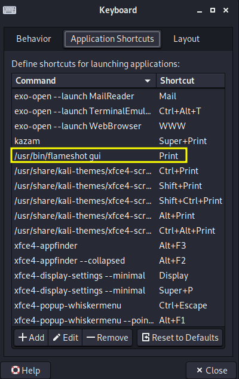

# Screenshot with auto save feature

## Goal

Screenshot as fast as we can

## Installation

```console
sudo apt update
sudo apt install flameshot
```

## Set as default application

1. Open keyboard settings
2. Select Application shortcut
3. change **Print** command to `/usr/bin/flameshot gui`


